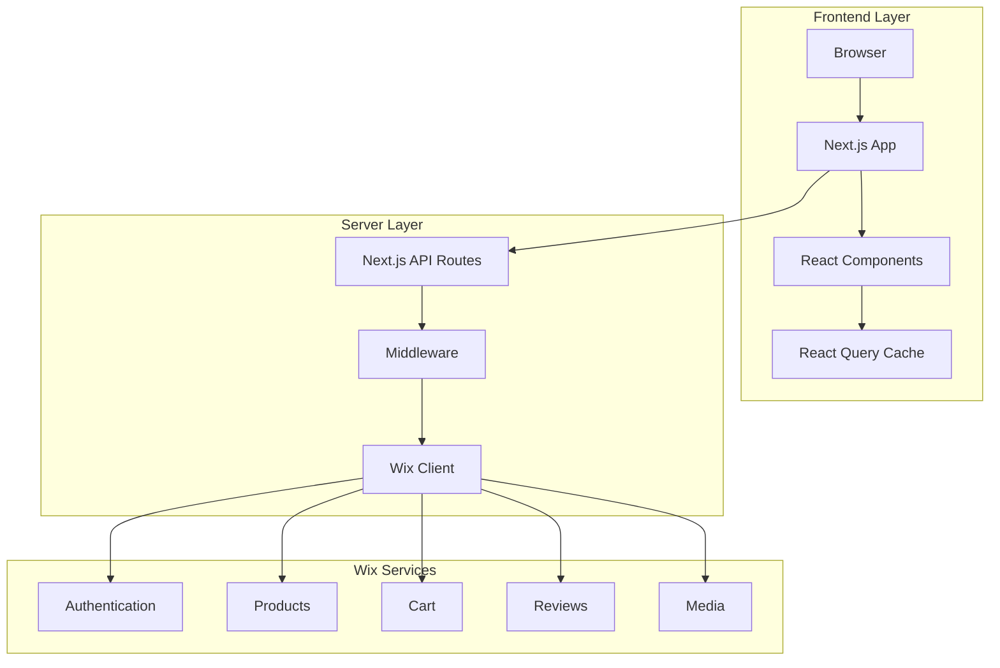
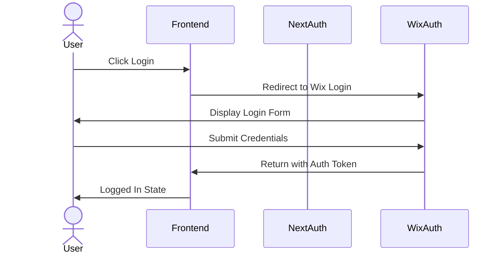
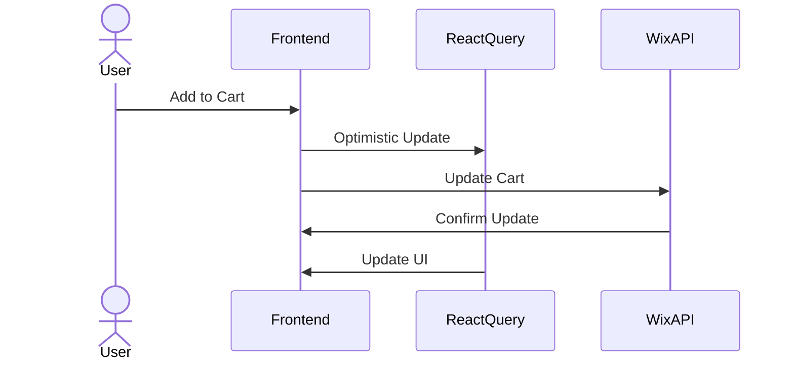

# Next Quality - System Architecture

## Overview

Next Quality is built using a modern headless architecture with Next.js 15 as the frontend and Wix Headless as the backend service.

## System Components

## Key Components

### Frontend Layer

- **Next.js App**: Main application framework
- **React Components**: UI components using Shadcn UI
- **React Query**: Data fetching and state management
- **TailwindCSS**: Styling and responsive design

### Server Layer

- **API Routes**: Handle server-side operations
- **Middleware**: Manages authentication and sessions
- **Wix Client**: Communicates with Wix APIs

### Wix Services

- **Authentication**: Handles user sessions and OAuth
- **Products**: Manages product catalog and inventory
- **Cart**: Handles shopping cart operations
- **Reviews**: Manages product reviews and ratings
- **Media**: Handles image and video uploads

## Authentication Flow

## Data Flow

### Shopping Cart Flow

## Technical Specifications

### Frontend

- Next.js 15
- React 19
- TailwindCSS
- Shadcn UI Components
- React Query for data management

### Server

- Next.js API Routes
- Wix SDK Integration
- OAuth Authentication
- File Upload Handling

### External Services

- Wix Headless CMS
- Wix Media Services
- Payment Processing
- Email Services

## Security Considerations

- OAuth 2.0 Authentication
- Secure Session Management
- HTTPS Encryption
- API Key Protection
- Rate Limiting

## Performance Optimizations

- React Query Caching
- Image Optimization
- Lazy Loading
- Server-Side Rendering
- Static Generation where possible

## Deployment Architecture

- Vercel Platform
- Edge Functions
- CDN Distribution
- Automatic HTTPS
