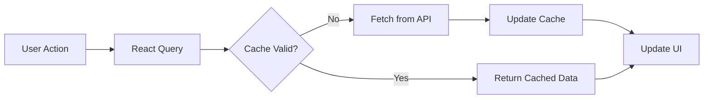
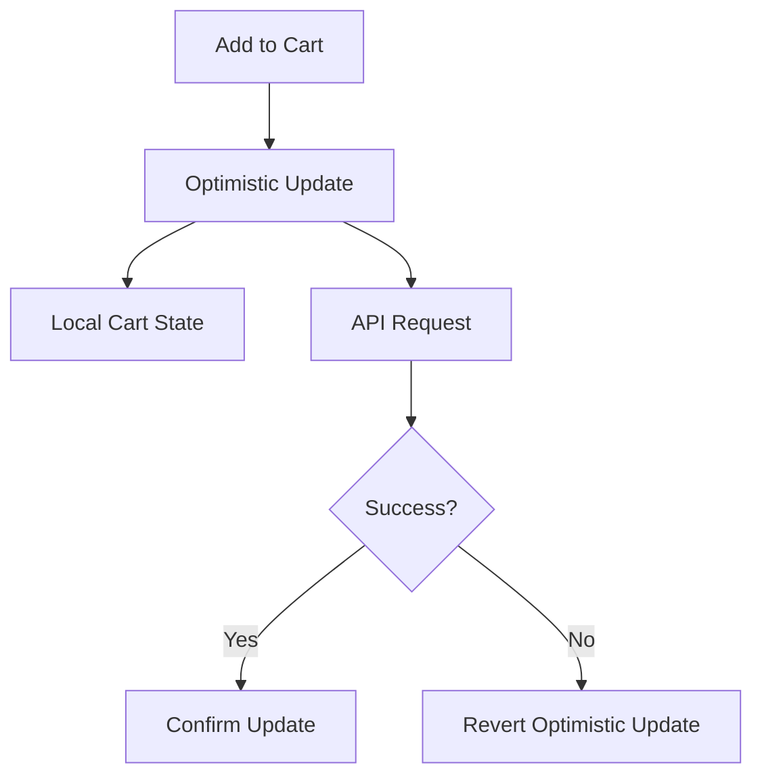
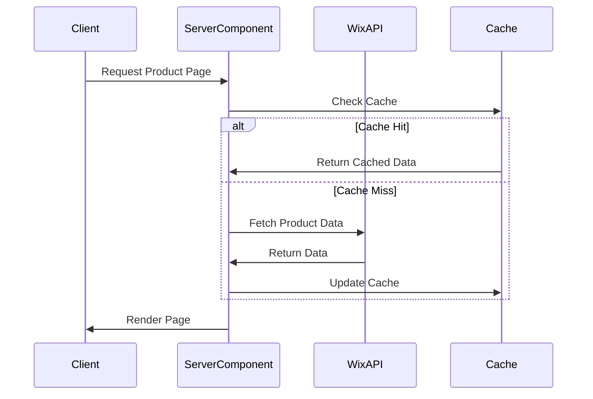
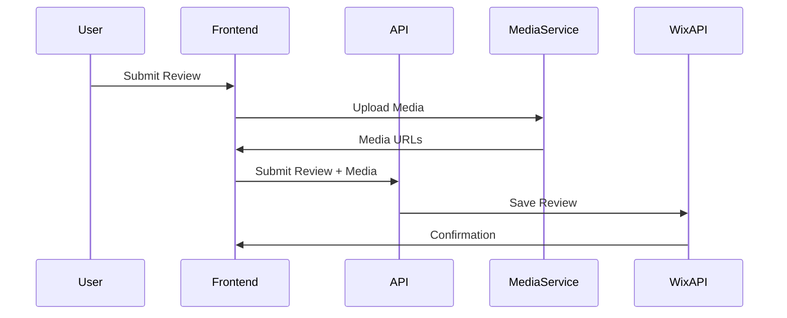
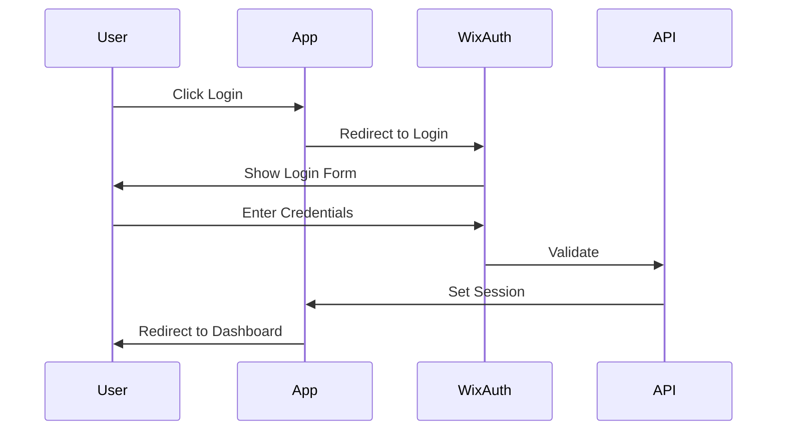
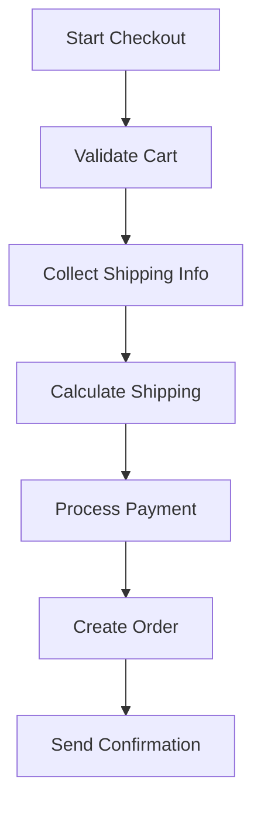
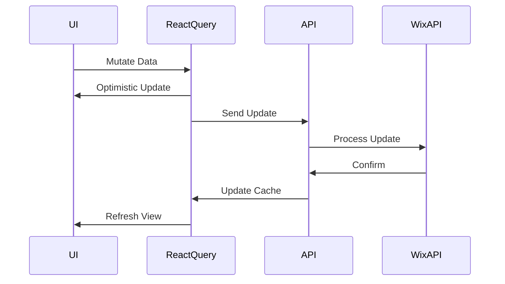
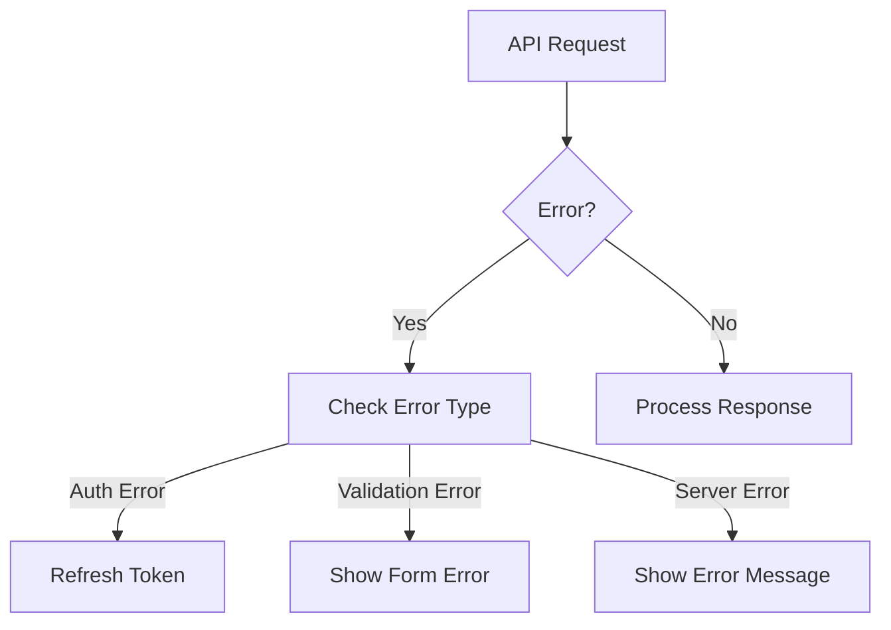

# Next Quality - Data Flow Documentation

## Table of Contents

- [State Management](#state-management)
- [Data Fetching](#data-fetching)
- [User Interactions](#user-interactions)
- [API Integration](#api-integration)

## State Management

### React Query Flow

### Shopping Cart State

## Data Fetching

### Product Data Flow

### Review System Flow

## User Interactions

### Authentication Flow

### Checkout Process

## API Integration

### Data Update Pattern

## Key Data Flows

### Product Catalog

- Server-side rendering of product lists
- Client-side filtering and sorting
- Infinite loading for product pages
- Real-time inventory updates

### Shopping Cart

- Anonymous cart creation
- Cart merging on login
- Real-time price updates
- Inventory validation

### User Sessions

- OAuth token management
- Session persistence
- Automatic token refresh
- Secure cookie handling

### Review System

- Media upload preprocessing
- Review submission validation
- Rating aggregation
- Review moderation flow

## Error Handling

### API Error Flow

## Performance Considerations

### Caching Strategy

- React Query cache configuration
- Server-side caching
- Static generation for product pages
- Incremental Static Regeneration

### Data Prefetching

- Critical data paths
- User-specific data
- Category pages
- Search results

## Monitoring and Analytics

- API call tracking
- Error logging
- Performance metrics
- User behavior analytics
