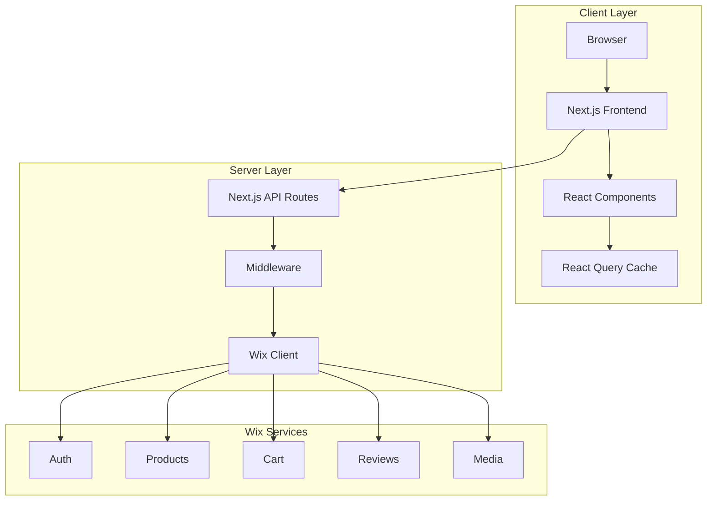
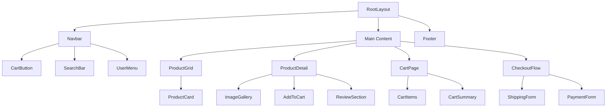
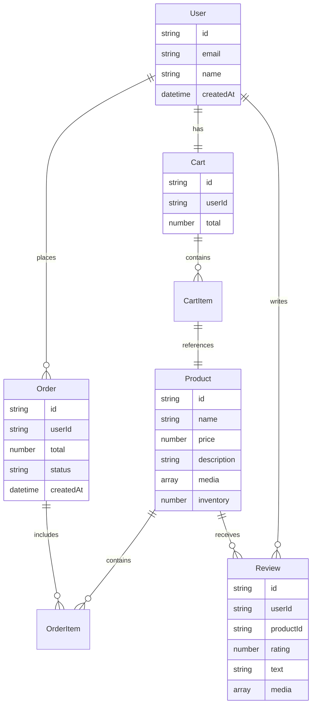
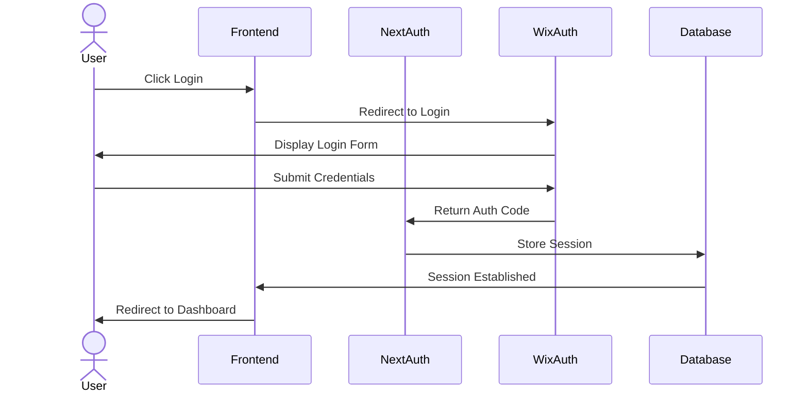
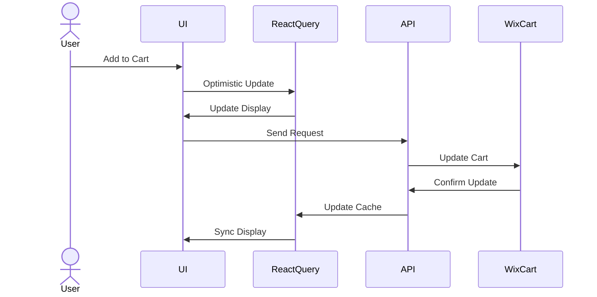
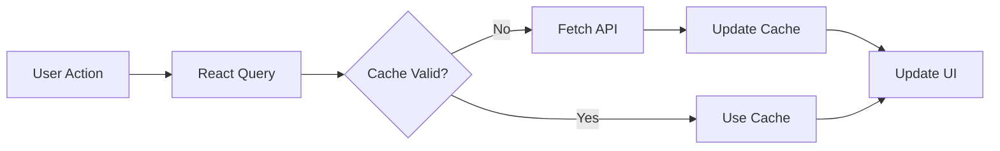

# Next Quality - System Diagrams

## Table of Contents

1. [System Architecture](#system-architecture)
2. [Component Hierarchy](#component-hierarchy)
3. [Data Model](#data-model)
4. [Authentication Flow](#authentication-flow)
5. [Shopping Cart Flow](#shopping-cart-flow)

## System Architecture

This diagram shows the three main layers of our application and how they interact.

## Component Hierarchy

This diagram illustrates the component structure of our application.

## Data Model

This diagram shows the relationships between different entities in our system.

## Authentication Flow

This diagram illustrates the authentication process.

## Shopping Cart Flow

This diagram shows the flow of data when adding items to the cart.

## State Management Flow

This diagram illustrates how state is managed using React Query.

## Notes

- All diagrams are created using Mermaid.js syntax
- Diagrams can be viewed directly on GitHub
- Use these diagrams for:
  - Development reference
  - Documentation
  - Team onboarding
  - Architecture discussions

## Contributing

When adding new features, please update relevant diagrams to maintain documentation accuracy.
